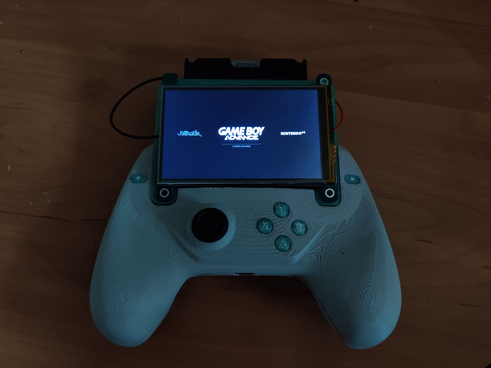

# Handheld Console
Based on Raspberry Pi Zero, uses Emulation Station to make games from other consoles (NES, GBA) available. Since Raspberry Pi has no analog inputs by default, a custom driver had to be written for it to be able to use the joystick. It uses I2C to read values from an analog to digital converter (ADS1115).

## TODO
- Add blender files used to 3D print the case
- Add the list of components