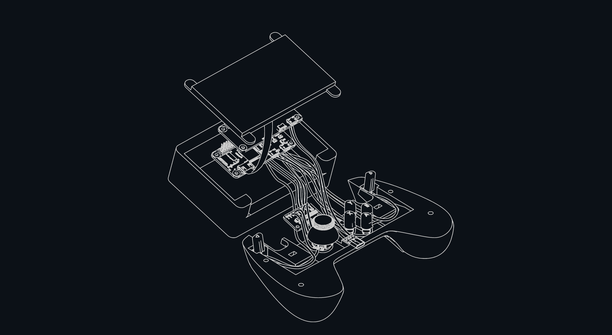

# Handheld Console
Based on Raspberry Pi Zero, uses Emulation Station to make games from other consoles (NES, GBA) available. Since Raspberry Pi has no analog inputs by default, a custom driver had to be written for it to be able to use the joystick. It uses I2C to read values from an analog to digital converter (ADS1115).

## Parts
<pre>
board:        Raspberry Pi Zero 2 W
power supply: DFRobot UPS Hat (MAX17043)
display:      Waveshare 12030
case:         Modified Steam Controller CAD files
adc:          Adafruit ADS1115
joysticks:    ALPS Stick Controller (RKJXV1220001)
</pre>
Special thanks to [Cryen](https://github.com/JustCryen) for creating the case and helping with electronics.
